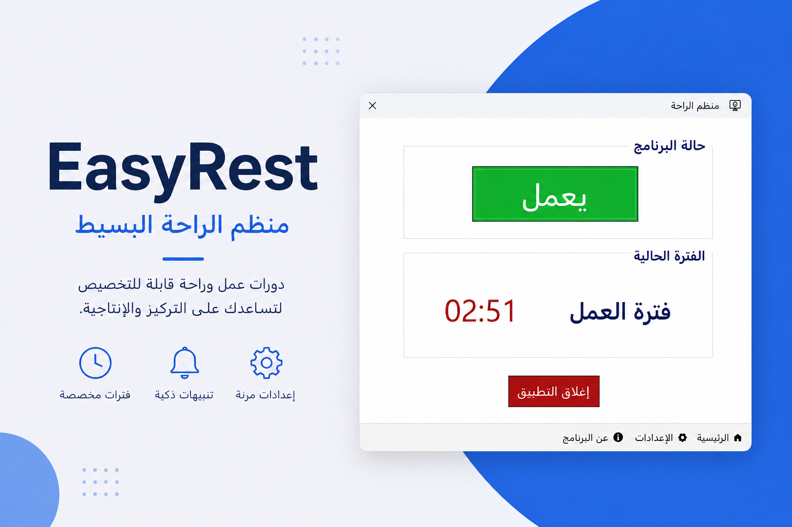

# EasyRest

> منظّم خفيف لفترات العمل والراحة على نظام Windows يساعدك على تحسين التركيز وتقليل الإرهاق أثناء العمل أو الدراسة.

---

## روابط

- 🌐 الموقع الرسمي: [زيارة الموقع](https://maketmimi.github.io/EasyRest-Website/)  
- ⬇️ تحميل التطبيق: [تحميل EasyRest](https://github.com/maketmimi/EasyRest/releases/download/v1.0.0/EasyRest.exe)

---

## نبذة

تطبيق بسيط يعمل مباشرة بعد تشغيله بدون تثبيت.

فكرته الأساسية هي مساعدتك على الحفاظ على توازن صحي بين العمل والراحة من خلال تنبيهات ذكية تظهر في الوقت المناسب أثناء استخدامك للحاسوب.

---

## لماذا EasyRest؟

- لا يحتاج إلى إعداد معقد  
- يبدأ العمل مباشرة بعد التشغيل  
- يمكن تخصيصه حسب أسلوبك  
- يعمل بصمت في الخلفية دون إزعاج  

---

## المميزات

- ضبط فترات العمل والراحة بسهولة  
- تنبيهات متعددة حسب الاختيار  
- مؤقت واضح داخل التطبيق  
- حفظ الإعدادات تلقائيًا  
- تصميم خفيف وسريع

---

## طريقة الاستخدام

1. تحميل الملف التنفيذي  
2. تشغيل التطبيق مباشرة  
3. تخصيص الإعدادات (اختياري)  
4. الاستمرار في العمل بشكل طبيعي

---

## التقنيات المستخدمة

- C#  
- .NET Framework  
- Windows Forms  

---

## ملاحظة

هذا التطبيق تم تطويره لأغراض التعلم والتجربة في مجال تطوير تطبيقات سطح المكتب على نظام Windows.

الهدف الأساسي من المشروع هو بناء تطبيق بسيط وعملي يساعد على فهم كيفية تصميم وتنفيذ أدوات إنتاجية خفيفة تعمل في الخلفية.

هذا المشروع ما يزال في مرحلة التطوير، وجميع الاقتراحات والأفكار لتحسينه موضع ترحيب.